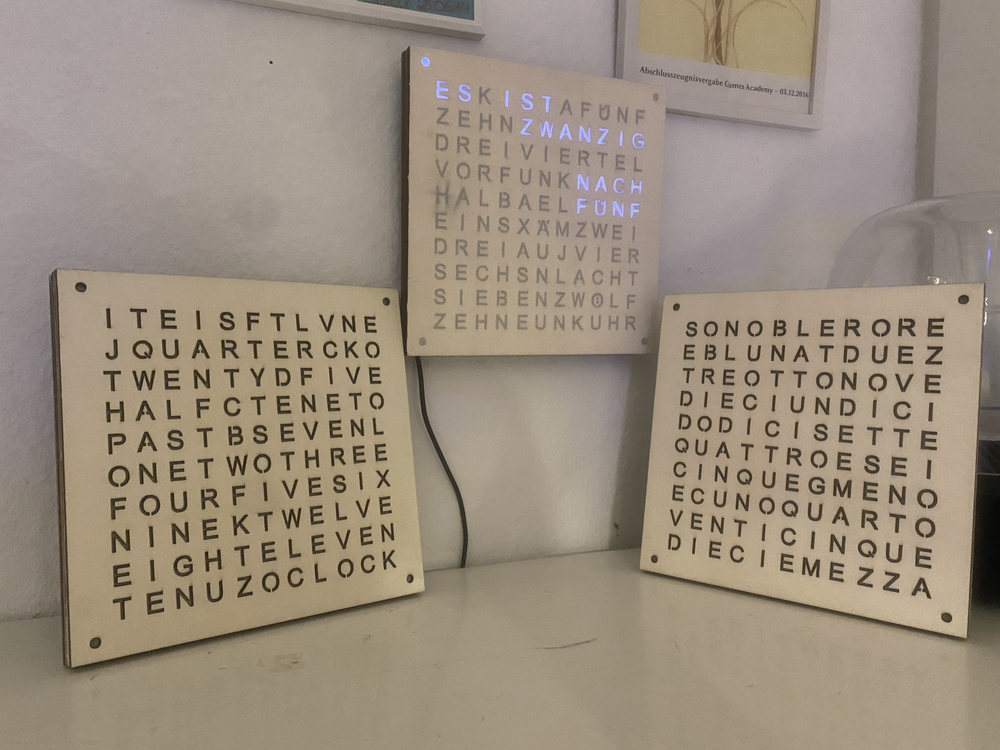
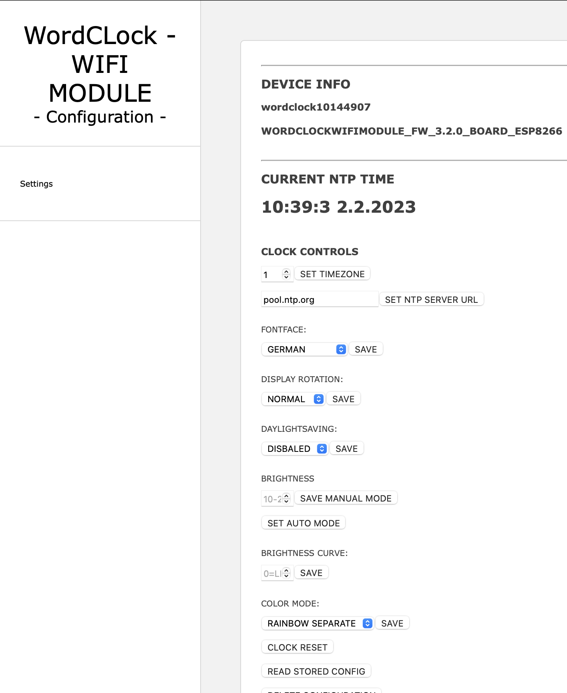
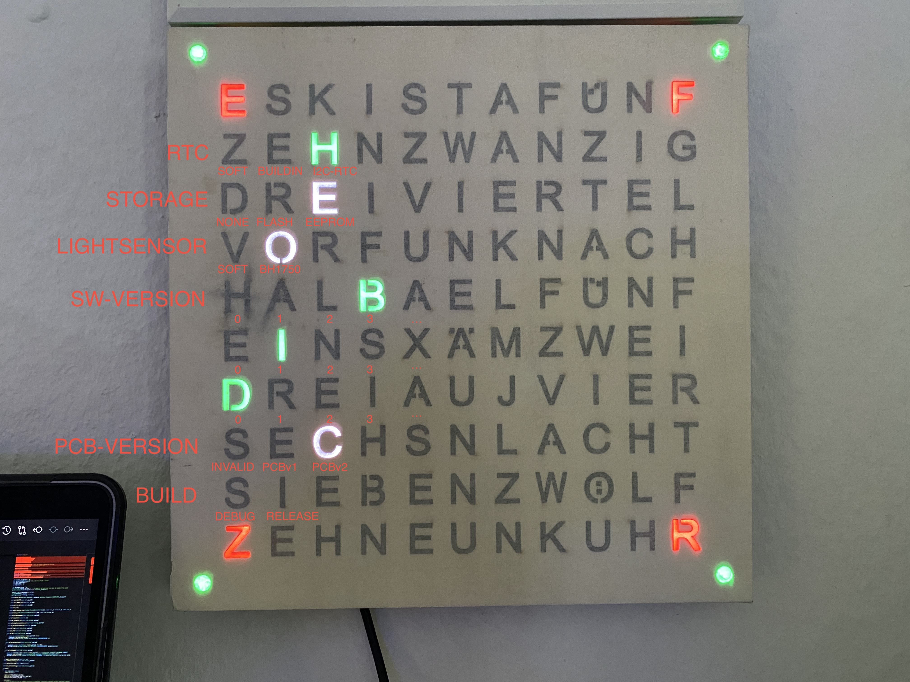
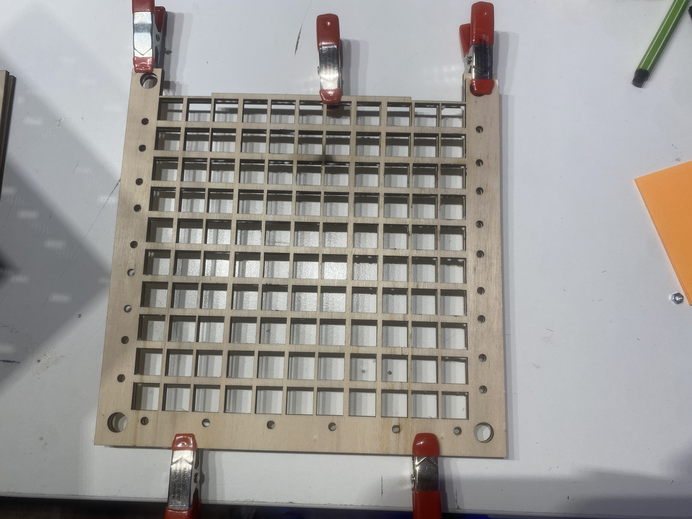
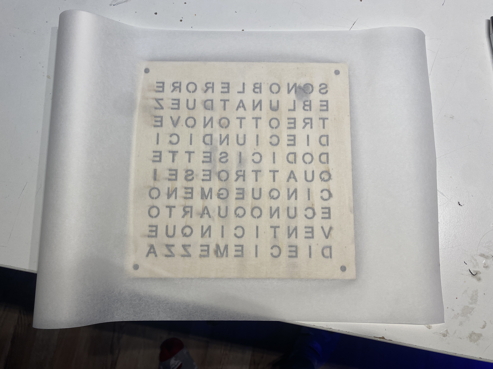
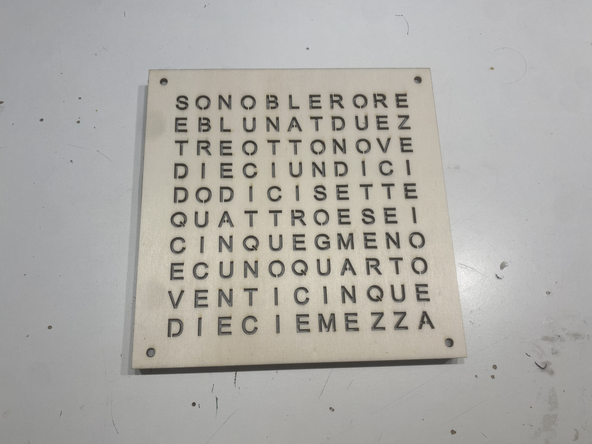
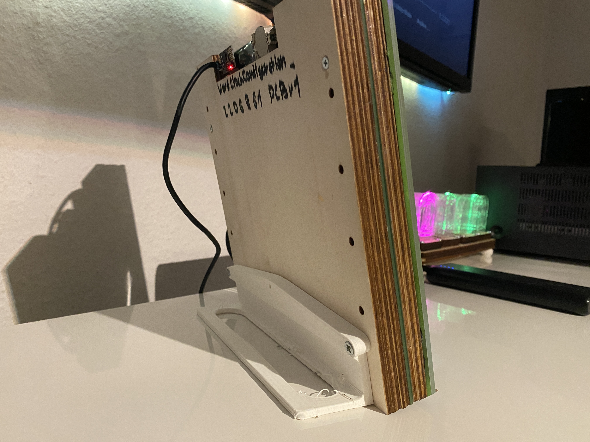
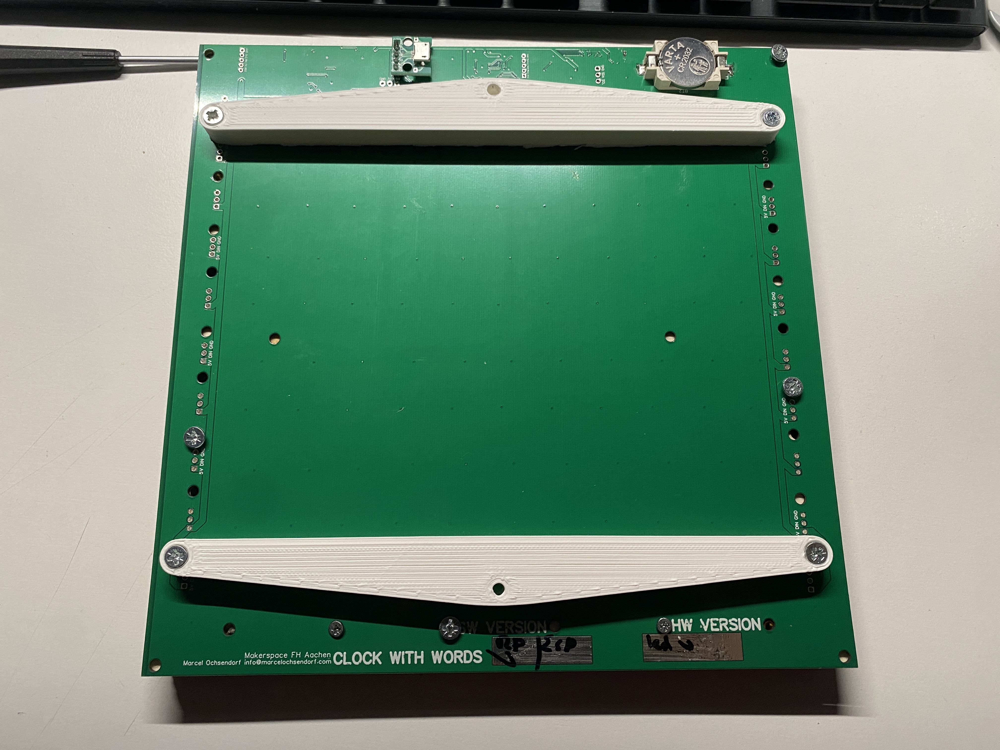

# Wordclock

## FEATURES
Simple easy to build tabletop wordclock with many features:

* different clockfaces and languages
* different colormodes (coldwhite, warmwhite, 2x rainbow)
* RP2040 based
* ambient light sensor
* temperature sensor
* eu summertime support
* optional wifi based sync and control

## IMPLEMENTED LANGUAGES

* GERMAN
* ENGLISH
* ITALIAN

### POSSIBLE LANGUAGES

* SPANISH
* DUTCH

## USER - MANUAL

### POWER UP

Connect the clock using its Micro-USB port on the back a USB power source like a PC or USB wallplug.
After a few seconds the clock lights up, depending on the configuration it may be that the brightness is set very low or the fontface is set incorrectly. To make these settings the web configuration can be used. Please follow the steps below to access the configuration webui.

### CONNECT CLOCK TO WIFI

To sync up the current time using NTP or setup the fontface or colors, connect the clock to a existing 2.4Ghz Wifi network.
After startup the clock check if the previous setup network exists. 
If not, the clock will open its own Wifi with the SSID `WordClockConfiguration_%ID%` (`%ID%` is the ID printed on the back of the clock).
After connecting, an captive portal should open, or by open the IP `192.168.4.1` in a web browser to set up the new Wifi.

### ACCESS CONFIGURATION WEBUI

After configuring the wifi, you can access the clock-configuration webpage using its DHCP address (see your router or nmap) or use the clocks mDNS adress `http://wordclock%%ID%%.local` with `%%ID%%` is the ID printed on the back of the clock, like: `http://wordclock10144907.local`.

**NOTE** After a wifi connection is established (power up, power cycle), the clock shows it on its display by means of the words. here the ip blocks are shown with the hours and the dot by using dark switching 0 or 12.

So `192.168.178.4` results in the following word order:
`one nine two  (pause)(dark 0/12)(pause) one six eight (pause)(dark 0/12)(pause) one seven eight (pause)(dark 0/12)(pause) four`

### FIRMWARE UPDATE

It is possible to update the software of the clock.
This adds new features like new languages and general bug fixes.
The software of the `RP2040` main processor can be done directly via the USB interface on the back.
To perform the update, a small button called `QBOOT` must be pressed and held while the watch is turned off and connected to a PC.
Now a new removable drive with the name `RP-BOOT` should appear. Now the update file is copied to it, afterwards the clock restarts.
If the update fails it can be done again by following the steps once more.

#### DOWNLOAD FIRMWARE UPDATE
Please identfy the clock hardware version, which is printed on the back of the clock or use the `STATUS CODE` display.

**STATUS CODE** Directly after startup, the clock shows some version information about the hardware revision and used software.

Information from example above:

* Hardware-Revision: 2 (PCBv2) so use `WORDCLOCK_V2_*.uf2` firmware files
* RTC: I2C (DS17307)
* Configuration-Storage: EEPROM
* Lightsensor: BH1750
* Software-Version: 3.1.0 (test), please use stable `Release` firmware

To download the latest software, please see the [Firmware-Releases](https://github.com/RBEGamer/WordClock/releases) page.
In general the current V2 clocks use the firmware: `WORDCLOCK_V2_RP2040_RP2040RTC_3.2.2_Release.uf2`.

**Note** All clocks produced before `01.11.2022` are hardware revision `V1` so please use:
[WORDCLOCK_V1_RP2040_RP2040RTC_3.2.2_Release.uf2](https://github.com/RBEGamer/WordClock/releases/download/v3.2.2/WORDCLOCK_V1_RP2040_RP2040RTC_3.2.2_Release.uf2)

## PARTS

### ELECTRICAL

* 1x ASSEMBLED PCB - `./src/pcb/vX`
* 1x MicroUSB to DIP breakout or USB Cable with open leads

### MECHANICAL

#### LASERCUT LAYERS 
**See `./src/lasercut` for cutting instructions**

All needed drawings are located in the `./src/lasercut/V2/layers_seperated` directory:

* 1x - BACKCOVER `3_backcover_layer` - >=3mm plywood (or plexiglas)
* 1x - SPACER `2_lightguide_layer` - >=3mm plywood (or plexiglas, but its hidden)
* 1x - SPACER `2_lightguidehexnut_layer` - >=3mm plywood (or plexiglas, but its hidden)
* 1x - FACEPLATE `1_text<LANGUAGE>_layer` - plexiglas, plywood >220x220mm 1mm

#### [OPTIONAL] 3D PRINTED STANDS

All needed files are located in the `./src/3d_print/` directory:

##### TABLESTAND
* 1x - TABLESTAND `wordclock_tablestand.stl`

##### WALLMOUNT
* 1x - WALLMOUNT `wordclock_wallmount.stl`

### OTHER

* sandwich paper - as additional semi transparent diffusor ontop of the leds
* woodglue - to glue spacers together
* isopropanol - plexiglas cleaning before gluing

### TOOLS

* lasercutter / cnc for cutting wood / plexiglas with working-area of at least 220mmx220mm
* 3d rpinter can be used to print the faceplates and spacers(conversion from svg-> 3mm stl is needed)

### ASSEMBLY INSTRUCTIONS

#### 0
Place some M4 nuts in the hexnut cutouts in the `lightguidehexnut` plate.

#### 1
Glue the spacers `lightguidehexnut` and `lightguide` using woodglue togehter.

#### 2
Place and glue the sandwichpaper ontop the the `lightguidehexnut` layer.

 
#### 3
Glue the `FACEPLATE` ontop of the sandwhichpaper, make sure that the cutout in the spacers is the top of the clock.

#### 4
Place the glued fontplate/spacer assembly ontop of the PCB and place the `BACKCOVER` on the back of the PCB.
Use the four M4 screws in the holes in the corners, to screw anything together.

#### 4 [OPTIONAL]

Mount the 3D-printed `wallmount` or `tablestand`.

##### TABLESTAND

##### WALLMOUNT

