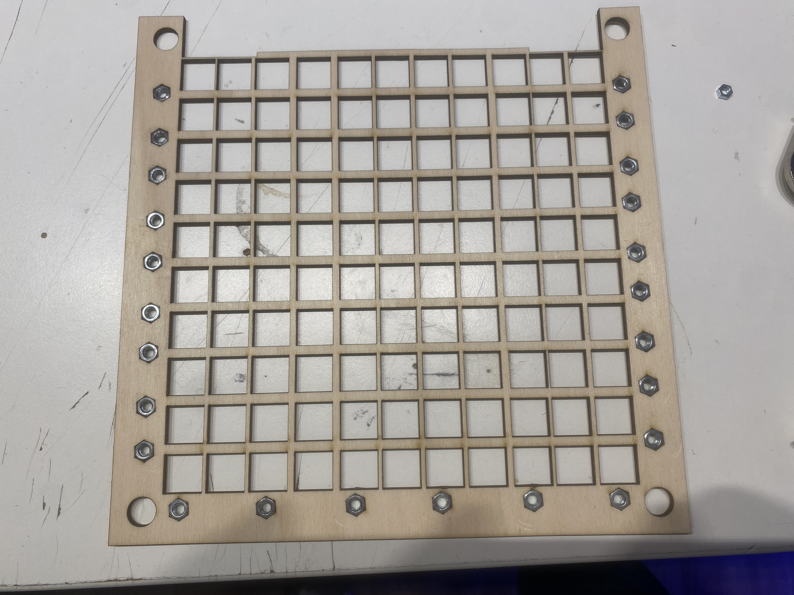

# Wordclock


## FEATURES
Simple easy to build tabletop wordclock with many features:

* different clockfaces and languages
* different colormodes (coldwhite, warmwhite, 2x rainbow)
* RP2040 based
* ambient light sensor
* temperature sensor
* eu summertime support
* optional wifi based sync and control

## IMPLEMENTED LANGUAGES

* GERMAN
* ENGLISH
* ITALIAN

### POSSIBLE LANGUAGES

* SPANISH
* DUTCH


## USER-MANUAL


### POWER UP

Connect the clock using its Micro-USB port on the back a USB power source like a PC or USB wallplug.
After a few seconds the clock lights up, depending on the configuration it may be that the brightness is set very low or the fontface is set incorrectly. To make these settings the web configuration can be used. Please follow the steps below to access the configuration webui.


### CONNECT CLOCK TO WIFI


To sync up the current time using NTP or setup the fontface or colors, connect the clock to a existing 2.4Ghz Wifi network.
After startup the clock check if the previous setup network exists. 


If not, the clock will open its own Wifi with the SSID `WordClockConfiguration_%ID%` (`%ID%` is the ID printed on the back of the clock).
After connecting, an captive portal should open, or by open the IP `192.168.4.1` in a web browser to set up the new Wifi.

**NOTE**
The configuration wifi will be disabled after one minute, so if it is not visible power cycle the board.

**NOTE**
If the clock cannot connect to the configured WLAN (not found, or invalid credentials,...), the configuration accesspoint is opened again.

### ACCESS CONFIGURATION WEBUI

After configuring the wifi, you can access the clock-configuration webpage using its DHCP address (see your router or nmap) or use the clocks mDNS adress `http://wordclock%%ID%%.local` with `%%ID%%` is the ID printed on the back of the clock, like: `http://wordclock10144907.local`.

**NOTE** After a wifi connection is established (power up, power cycle), the clock shows it on its display by means of the words. here the ip blocks are shown with the hours and the dot by using dark switching 0 or 12.

So `192.168.178.4` results in the following word order:
`one nine two  (pause)(dark 0/12)(pause) one six eight (pause)(dark 0/12)(pause) one seven eight (pause)(dark 0/12)(pause) four`


### FIRMWARE UPDATE

It is possible to update the software of the clock.
This adds new features like new languages and general bug fixes.
The software of the `RP2040` main processor can be updated directly via the USB interface on the back.
To perform the update, a small button called `QBOOT` must be pressed and held while the watch is turned off and connected to a PC.


You can press the button even when the clock is assembled.
The button is accessible through the cutout on the top of the clock near the USB port.


Now a new removable drive with the name `RP-BOOT` should appear.
Now copy (or drag&drop) the `.u2f` update file to the drive.
After the copy process is complete, the drive disappears automatically and the clock restarts.
If the update fails, you can do it again by repeating the steps.


**NOTE**
Check the firmware version after an update using the [STATUS-CODES](#status-codes).

**NOTE**
On MacOS drag&drop installation can fail, so please try `$ cp ./WORDCLOCK_Vx_RP2040_x.y.z_Release.uf2 /Volumes/RPI-RP2/` from the Terminal-App instead.

**NOTE**
Instead of reconnecting the USB cable, there is an other button called `RPRST` which can be pressed once, while keep holding the `QBOOT` button.

#### DOWNLOAD FIRMWARE UPDATE
Please identfy the clock hardware version, which is printed on the back of the clock or use the [STATUS-CODES](#status-codes) display.

##### STATUS CODES
Directly after startup, the clock shows some version information about the hardware revision and used software.
This information is language-independent and is displayed in the form of individual illuminated LEDs.
On the following picture their meaning can be determined.


Information from example above:

* Hardware-Revision: 2 (`PCBv2`) so use `WORDCLOCK_V2_*.uf2` firmware files
* RTC: `I2C (DS17307)`
* Configuration-Storage: `EEPROM`
* Lightsensor: `BH1750`
* Software-Version: 3.1.0 (test), please use stable `Release` firmware


To download the latest software, please see the [Firmware-Releases](https://github.com/RBEGamer/WordClock/releases) page.
For the current `V2` clocks, use the latest firmware file: `WORDCLOCK_V2_RP2040_RP2040RTC_x.y.z_Release.uf2`.

For the `V1` clocks, use the archived firmware: `WORDCLOCK_V1_RP2040_3.1.0_Release.uf2`.

**Note**
If `RTC`, `Lightsensor` and `Storage` are set to `SOFT` and `None`/`FLASH` please use firmware `WORDCLOCK_Vx_NOI2C_*.u2f`.
* RTC: `SOFT`
* Configuration-Storage: `FLASH` or `NONE`
* Lightsensor: `SOFT`

[WORDCLOCK_V2_RP2040_NOI2C_3.2.2_Release.uf2](https://github.com/RBEGamer/WordClock/releases/download/v3.2.2/WORDCLOCK_V2_RP2040_NOI2C_3.2.2_Release.uf2)


### FIRMWARE CUSTOMIZATION

It is also possible to make your own adjustments to the clock's firmware, e.g. to add your own languages or animations.

It is recommended to use Visual Code with the following plugins as the editor, since the project already has all the necessary settings and also a debug environment configured. This makes it easy to get started.

* `C/C++` by `Microsoft`
* `Cortex-Debug` by `marus25` 

The complete firmware of the RP2040 main processor is available in the `src/base/wordclock/src` folder.
If you want to develop your own fontface, see the examples in  `wordclock_faceplate` and the `wordclock_faceplate_template.*` files.


#### BUILDING THE FIRMWARE YOURSELF

```bash

$ git clone --depth 1 https://github.com/RBEGamer/WordClock.git ~/WordClock
$ cd ~/WordClock/base/wordclock/
# UPDATE CMAKE PATHS
$ rm -Rf build CMakeCache.txt CMakeFiles elf2uf2 generated pioasm WORDCLOCK_* build_u2f
# see board folder for available PCB-Revisions
# for example to build the firmware for a PCBv2 use WORDCLOCK_V2_RP2040_RP2040RTC
## RELEAE
$ cmake -DCMAKE_BUILD_TYPE=Release -DWORDCLOCK_BOARD=WORDCLOCK_V2_RP2040_RP2040RTC .
## DEBUG
$ cmake -DCMAKE_BUILD_TYPE=Debug -DWORDCLOCK_BOARD=WORDCLOCK_V2_RP2040_RP2040RTC .
PICO_SDK_PATH is ~/WordClock/src/base/pico-sdk
Defaulting PICO_PLATFORM to rp2040 since not specified.
Defaulting PICO platform compiler to pico_arm_gcc since not specified.
PICO compiler is pico_arm_gcc
-- The C compiler identification is GNU 10.3.1
-- The CXX compiler identification is GNU 10.3.1
-- The ASM compiler identification is GNU
-- Found assembler: /opt/homebrew/bin/arm-none-eabi-gcc
Build type is Release
PICO target board is WORDCLOCK_V2_RP2040_RP2040RTC.


# BUILD
# on first build the pico-sdk will be downloaded
# the result should be a WORDCLOCK_V2_RP2040_RP2040RTC_3.2.3_Debug.uf2
$ make -j8
[ 97%] Linking CXX executable WORDCLOCK_V2_RP2040_RP2040RTC_3.2.3_Debug.elf
[100%] Built target wordclock


# FLASH
# you can use the drag&drop method to install the firmware or use the pico-tool with a usb connected clock.
# see flash_release.sh or flash_release.sh
$ ../picotool/picotool load -f *.uf2 && ../picotool/picotool reboot
```

**NOTE**
To build the a new firmware relase, for all clock hardware-revisions you can use the `build_all.sh` script.
It builds the `.u2f` for each board definition located in the `board` folder and stores the build artefacts in `build_u2f`.


## BUILD YOUR OWN CLOCK

### PARTS

The latest version of the clock is currently `v2` so please replace `vX` with `v2` in the following instructions.


#### ELECTRICAL

* 1x ASSEMBLED PCB - `./src/pcb/vX`
* 1x MicroUSB to DIP breakout or USB Cable with open leads

#### MECHANICAL

##### LASERCUT LAYERS 
**See `./src/lasercut` for cutting instructions**

All needed drawings are located in the `./src/lasercut/vX/layers_seperated` directory:

* 1x - BACKCOVER `3_backcover_layer` - >=3mm plywood (or plexiglas)
* 1x - SPACER `2_lightguide_layer` - >=3mm plywood (or plexiglas, but its hidden)
* 1x - SPACER `2_lightguidehexnut_layer` - >=3mm plywood (or plexiglas, but its hidden)
* 1x - FACEPLATE `1_text<LANGUAGE>_layer` - plexiglas, plywood >220x220mm 1mm

##### [OPTIONAL] 3D PRINTED STANDS

All needed files are located in the `./src/3d_print/` directory:

####### TABLESTAND
* 1x - TABLESTAND `wordclock_tablestand.stl`

####### WALLMOUNT
* 1x - WALLMOUNT `wordclock_wallmount.stl`

#### OTHER

* sandwich paper - as additional semi transparent diffusor ontop of the leds
* woodglue - to glue spacers together
* isopropanol - plexiglas cleaning before gluing


#### TOOLS

* lasercutter / cnc for cutting wood / plexiglas with working-area of at least 220mmx220mm
* 3d rpinter can be used to print the faceplates and spacers(conversion from svg-> 3mm stl is needed)

#### ASSEMBLY INSTRUCTIONS

##### 0 - INSERT HEXNUTS
Place some M4 nuts in the hexnut cutouts in the `lightguidehexnut` plate.


##### 1 - GLUE SPACERS TOGEHTER
Glue the spacers `lightguidehexnut` and `lightguide` using woodglue togehter.


##### 2 - ADD  DIFFUSOR
Place and glue the sandwichpaper ontop the the `lightguidehexnut` layer.

 
##### 3 - ADD FACEPLATE
Glue the `FACEPLATE` ontop of the sandwhichpaper, make sure that the cutout in the spacers is the top of the clock.


##### 4 - ASSEMBLY
Place the glued fontplate/spacer assembly ontop of the PCB and place the `BACKCOVER` on the back of the PCB.
Use the four M4 screws in the holes in the corners, to screw anything together.


##### 5 - WALLMOUNT / TABLESTAND [OPTIONAL]

Mount the 3D-printed `wallmount` or `tablestand`.

###### TABLESTAND


###### WALLMOUNT


##### 6

Flash the firmware to the clock using the [USER-MANUAL](#user-manual)
