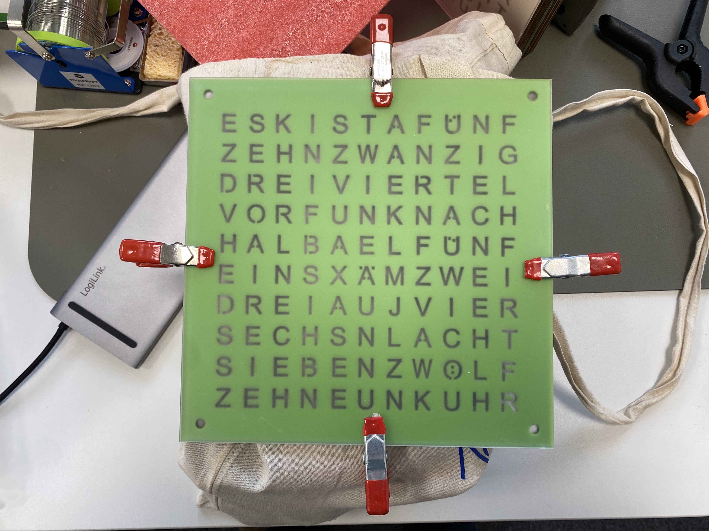
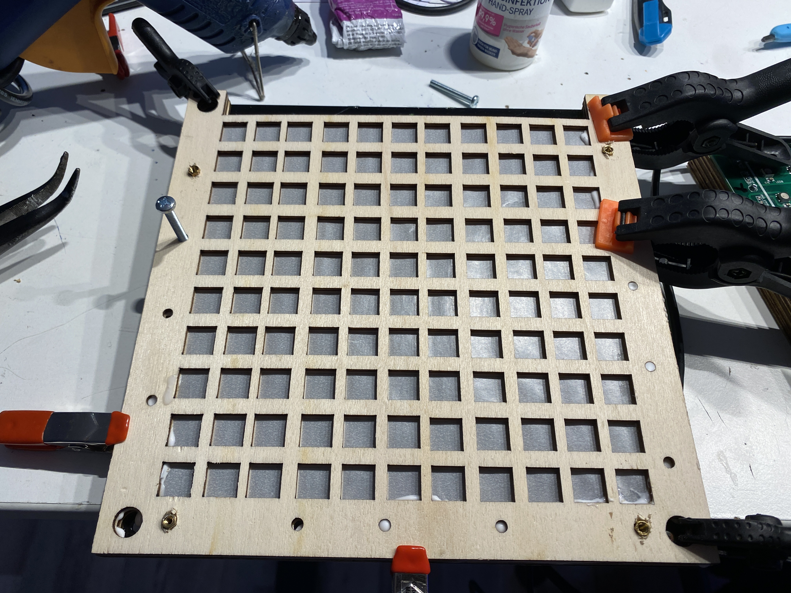

# LASERCUT

## PCBv1

Glue the wooden pieces together in the following order: 

* 1x - `drawing_chars`
* 3x - `drawing_lightguide`
* `--- PCB ---`
* 2x - `drawing_back`

## PCBv2

the V2 lasercutting files are loacated in the `./v2` folder.
The main source files is the single `drawing.svg` file, which contains several numbered layer object in it.
Objects in `[]` can be ignored, these are used for reference linke the `[PCBv2]` image of the PCB.

Each layer object in the svg will be used to cut one piece for the clock.
Some layers are needed multible times and will be glued together to form a higher single layer.

### FACEPLATE (PLEXIGLAS)

* 1x - `0_opaque_layer` - this is the semi-transparent toplayer plexiglas
* 1x - `1_<LANGUAGE>_layer` - this is the textlayer with the cut out characters

 Clean (isopropanol), place and clamp! the `0_opaque_layer` and `1_<LANGUAGE>_layer` layer ontop of each other and use the `ACRIFIX Plexiglas glue` to fill the minute dot holes with the glue and let it dry for at least 8h.

### LIGHTGUIDE (WOOD)

* 1x - `2_lightguidehexnut_layer` - its use to get some space between the leds and the text faceplate
* 2x - `2_lightguidenormal_layer` - its use to get some space between the leds and the text faceplate

Glue the two `2_lightguidenormal_layer` sheets together and before adding the third one add one sheet of sandwich paper/ semi transparent diffusor between them.
In the end this additional diffusor sit ontop of the leds with one lightguide seperating them.
You can place screws in the holes to align everything during curing.

### BACKCOVER

* 1x - `3_backcover`

## STACK

